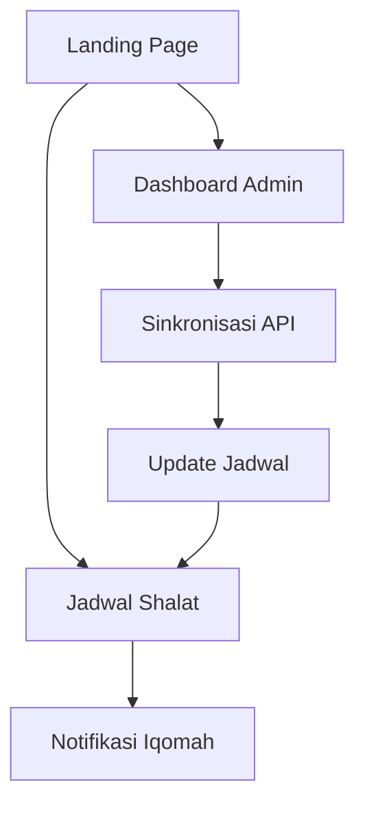

## 1. Product Overview
Aplikasi web Masjid Kita adalah platform digital untuk pengelolaan jadwal shalat masjid berbasis web. Aplikasi ini menyediakan informasi waktu shalat yang akurat dari API Kemenag serta fitur alarm untuk iqomah.

Target pengguna adalah pengurus masjid dan jamaah yang ingin mendapatkan informasi jadwal shalat secara real-time dengan tampilan yang modern dan user-friendly.

## 2. Core Features

### 2.1 User Roles
| Role | Registration Method | Core Permissions |
|------|---------------------|------------------|
| Admin | Manual registration by developer | Full access to dashboard, can manage prayer times, configure settings |
| Visitor | No registration required | View prayer times, receive iqomah notifications |

### 2.2 Feature Module
Aplikasi Masjid Kita terdiri dari halaman-halaman berikut:
1. **Landing Page**: Hero section, informasi masjid, jadwal shalat hari ini, tombol navigasi.
2. **Dashboard Admin**: Pengaturan waktu shalat, sinkronisasi API Kemenag, konfigurasi alarm iqomah.
3. **Jadwal Shalat**: Tampilan jadwal lengkap, countdown timer, notifikasi iqomah.

### 2.3 Page Details
| Page Name | Module Name | Feature description |
|-----------|-------------|---------------------|
| Landing Page | Hero Section | Menampilkan nama masjid, gambar masjid, dan slogan dengan desain yang menarik. |
| Landing Page | Jadwal Shalat Hari Ini | Menampilkan waktu shalat untuk hari ini dalam format kartu yang mudah dibaca. |
| Landing Page | Informasi Masjid | Menampilkan alamat, kontak, dan informasi umum masjid. |
| Landing Page | Navigation | Menuju dashboard admin dan halaman jadwal lengkap. |
| Dashboard Admin | Sinkronisasi API | Ambil data waktu shalat dari API Kemenag untuk lokasi tertentu. |
| Dashboard Admin | Manajemen Jadwal | Edit manual jadwal shalat jika diperlukan. |
| Dashboard Admin | Konfigurasi Alarm | Atur durasi iqomah dan pengaturan notifikasi. |
| Dashboard Admin | Dashboard Overview | Statistik kunjungan dan status sistem. |
| Jadwal Shalat | Countdown Timer | Hitung mundur menuju waktu shalat berikutnya. |
| Jadwal Shalat | Alarm Iqomah | Notifikasi audio dan visual saat iqomah. |
| Jadwal Shalat | Tampilan Digital Clock | Jam digital besar untuk display di masjid. |

## 3. Core Process
**Flow Pengunjung**: Landing Page → Jadwal Shalat → Menerima Notifikasi Iqomah

**Flow Admin**: Login → Dashboard → Sinkronisasi API → Konfigurasi Pengaturan → Monitoring

## 4. User Interface Design

### 4.1 Design Style
- **Warna Utama**: Hijau Islami (#2D8F47) dan putih
- **Warna Sekunder**: Emas (#D4AF37) untuk aksen
- **Gaya Tombol**: Rounded dengan shadow halus
- **Font**: Inter untuk modern readability, Arabic font untuk teks Arab
- **Layout**: Card-based dengan grid system
- **Ikon**: Material Design icons dengan gaya outlined

### 4.2 Page Design Overview
| Page Name | Module Name | UI Elements |
|-----------|-------------|-------------|
| Landing Page | Hero Section | Background gradient hijau keputihan, teks besar nama masjid, gambar masjid overlay dengan opacity. |
| Landing Page | Jadwal Shalat | Card berwarna putih dengan border hijau, font besar untuk waktu, ikon matahari untuk indicator waktu. |
| Dashboard Admin | Data Table | Tabel clean dengan striped rows, action buttons dengan ikon, status badge. |
| Jadwal Shalat | Countdown | Display besar dengan angka merah, progress bar, animasi smooth. |
| Jadwal Shalat | Alarm | Modal popup dengan animasi fade, suara alarm, button dismiss besar. |

### 4.3 Responsiveness
Desktop-first design dengan mobile-adaptive layout. Touch interaction optimization untuk display touchscreen di masjid.