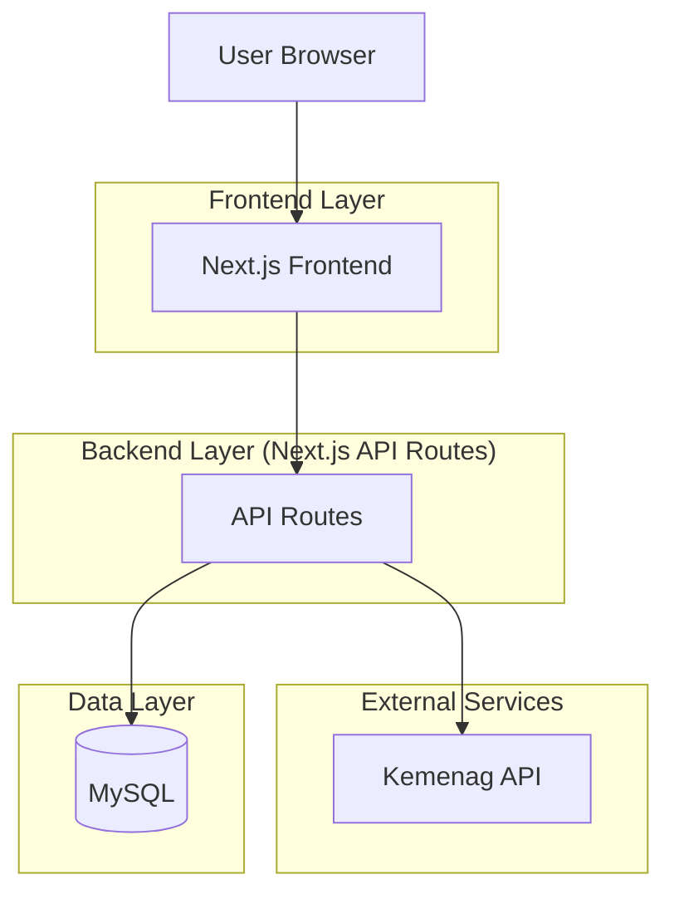
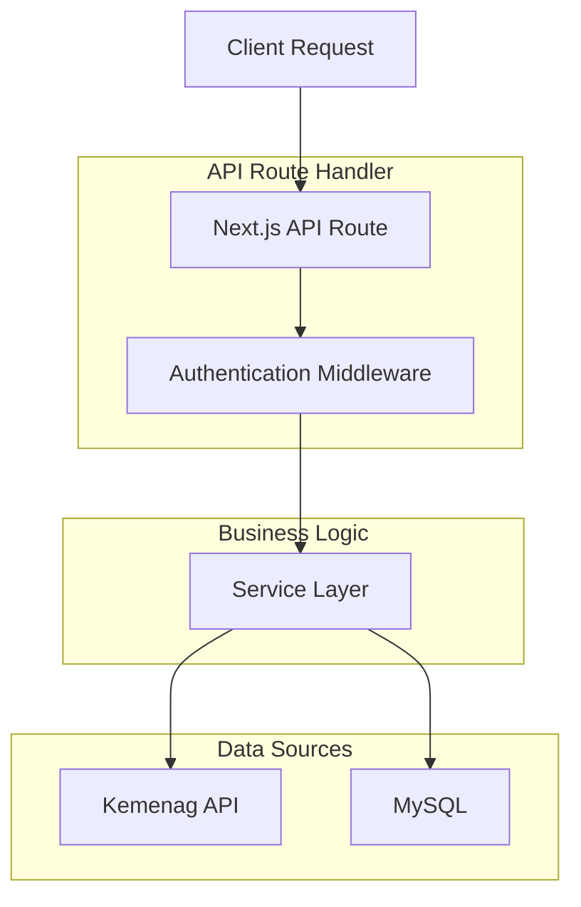
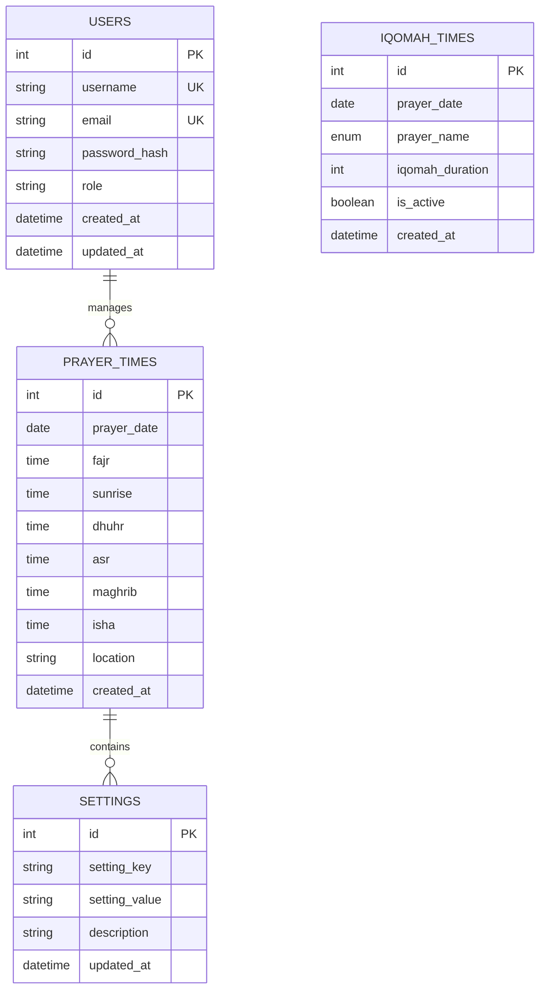

## 1. Architecture Design



## 2. Technology Description

- **Frontend**: Next.js@14 + React@18 + TypeScript
- **UI Library**: shadcn/ui + TailwindCSS@3
 - **Database**: MySQL (Shared Hosting)
 - **Authentication**: NextAuth.js (Prisma Adapter, MySQL)
 - **State Management**: React Context + SWR
 - **API Integration**: Axios for external API calls
 - **Initialization Tool**: create-next-app
 - **ORM**: Prisma (provider `mysql`)

## 3. Route Definitions

| Route | Purpose |
|-------|---------|
| / | Landing page utama |
| /jadwal | Halaman jadwal shalat lengkap |
| /admin | Dashboard admin untuk manajemen |
| /admin/login | Halaman login admin |
| /api/auth/* | Authentication endpoints |
| /api/prayer-times/* | Prayer times API endpoints |
| /api/kemenag/* | Kemenag API proxy |

## 4. API Definitions

### 4.1 Authentication API
```
POST /api/auth/login
```

Request:
| Param Name | Param Type | isRequired | Description |
|------------|------------|------------|-------------|
| username | string | true | Username admin |
| password | string | true | Password admin |

Response:
| Param Name | Param Type | Description |
|------------|------------|-------------|
| success | boolean | Status login |
| token | string | JWT token |
| user | object | User data |

### 4.2 Prayer Times API
```
GET /api/prayer-times/today
```

Response:
| Param Name | Param Type | Description |
|------------|------------|-------------|
| date | string | Tanggal hari ini |
| fajr | string | Waktu subuh |
| sunrise | string | Waktu terbit |
| dhuhr | string | Waktu dzuhur |
| asr | string | Waktu ashar |
| maghrib | string | Waktu maghrib |
| isha | string | Waktu isya |
| location | string | Lokasi masjid |

### 4.3 Kemenag API Integration
```
GET /api/kemenag/sync
```

Request:
| Param Name | Param Type | isRequired | Description |
|------------|------------|------------|-------------|
| city | string | true | Nama kota |
| month | number | true | Bulan (1-12) |
| year | number | true | Tahun |

## 5. Server Architecture Diagram



## 6. Data Model

### 6.1 Database Schema



### 6.2 Data Definition Language

**Users Table (MySQL)**
```sql
CREATE TABLE users (
  id INT PRIMARY KEY AUTO_INCREMENT,
  username VARCHAR(50) UNIQUE NOT NULL,
  email VARCHAR(255) UNIQUE NOT NULL,
  password_hash VARCHAR(255) NOT NULL,
  role ENUM('admin') DEFAULT 'admin',
  created_at TIMESTAMP DEFAULT CURRENT_TIMESTAMP,
  updated_at TIMESTAMP DEFAULT CURRENT_TIMESTAMP ON UPDATE CURRENT_TIMESTAMP
);
```

**Prayer Times Table (MySQL)**
```sql
CREATE TABLE prayer_times (
  id INT PRIMARY KEY AUTO_INCREMENT,
  prayer_date DATE UNIQUE NOT NULL,
  fajr TIME NOT NULL,
  sunrise TIME NOT NULL,
  dhuhr TIME NOT NULL,
  asr TIME NOT NULL,
  maghrib TIME NOT NULL,
  isha TIME NOT NULL,
  location VARCHAR(100) DEFAULT 'Jakarta',
  source VARCHAR(50) DEFAULT 'kemenag',
  created_at TIMESTAMP DEFAULT CURRENT_TIMESTAMP
);

CREATE INDEX idx_prayer_times_date ON prayer_times(prayer_date);
CREATE INDEX idx_prayer_times_location ON prayer_times(location);
```

**Settings Table (MySQL)**
```sql
CREATE TABLE settings (
  id INT PRIMARY KEY AUTO_INCREMENT,
  setting_key VARCHAR(100) UNIQUE NOT NULL,
  setting_value TEXT,
  description TEXT,
  updated_at TIMESTAMP DEFAULT CURRENT_TIMESTAMP ON UPDATE CURRENT_TIMESTAMP
);

INSERT INTO settings (setting_key, setting_value, description) VALUES
('mosque_name', 'Masjid Kita', 'Nama masjid'),
('mosque_address', 'Jl. Contoh No. 123', 'Alamat masjid'),
('iqomah_default_duration', '10', 'Durasi iqomah default (menit)'),
('auto_sync_enabled', 'true', 'Status auto sync dengan Kemenag API'),
('last_sync_date', '', 'Tanggal sync terakhir');
```

**Iqomah Times Table (MySQL)**
```sql
CREATE TABLE iqomah_times (
  id INT PRIMARY KEY AUTO_INCREMENT,
  prayer_date DATE NOT NULL,
  prayer_name ENUM('fajr','dhuhr','asr','maghrib','isha') NOT NULL,
  iqomah_duration INT DEFAULT 10,
  is_active BOOLEAN DEFAULT TRUE,
  created_at TIMESTAMP DEFAULT CURRENT_TIMESTAMP,
  UNIQUE KEY uniq_prayer_date_name (prayer_date, prayer_name)
);

CREATE INDEX idx_iqomah_times_date ON iqomah_times(prayer_date);
CREATE INDEX idx_iqomah_times_active ON iqomah_times(is_active);
```
